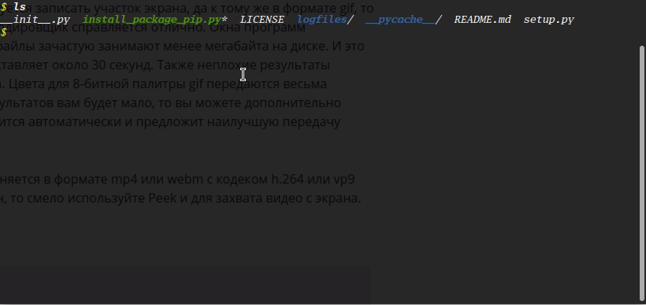

#install_package_pip

Программа `install_package_pip` предназначена для загрузки пакетов с помощью 
установщика пакетов `pip`

Формат записи:</br>
```
$ install_package_pip.py treads:int [packages]:str
```
Пример:</br>
```
$ install_package_pip.py 2 SciPy Numpy
```

Также можно использовать `install_package_pip` как модуль для автоматической загрузки пакетов с использованием многопоточности

Формат записи:</br>
``` python
import install_package_pip

install_package_pip(tread:int, packages:dict)
```

Пример:</br>
``` python
import install_package_pip

packages = [package for package in ('Numpy', 'SciPy', 'loguru')]
treads = 3

install = install_package_pip(treads, packages)
```

